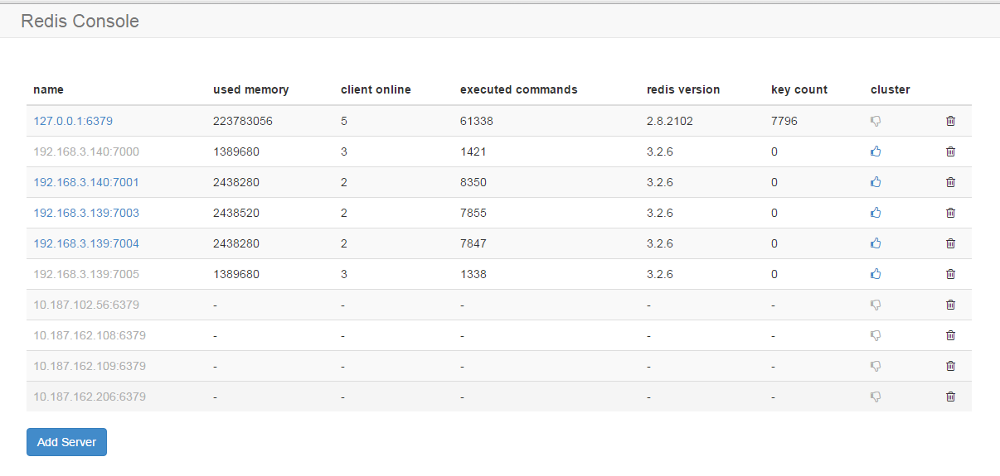
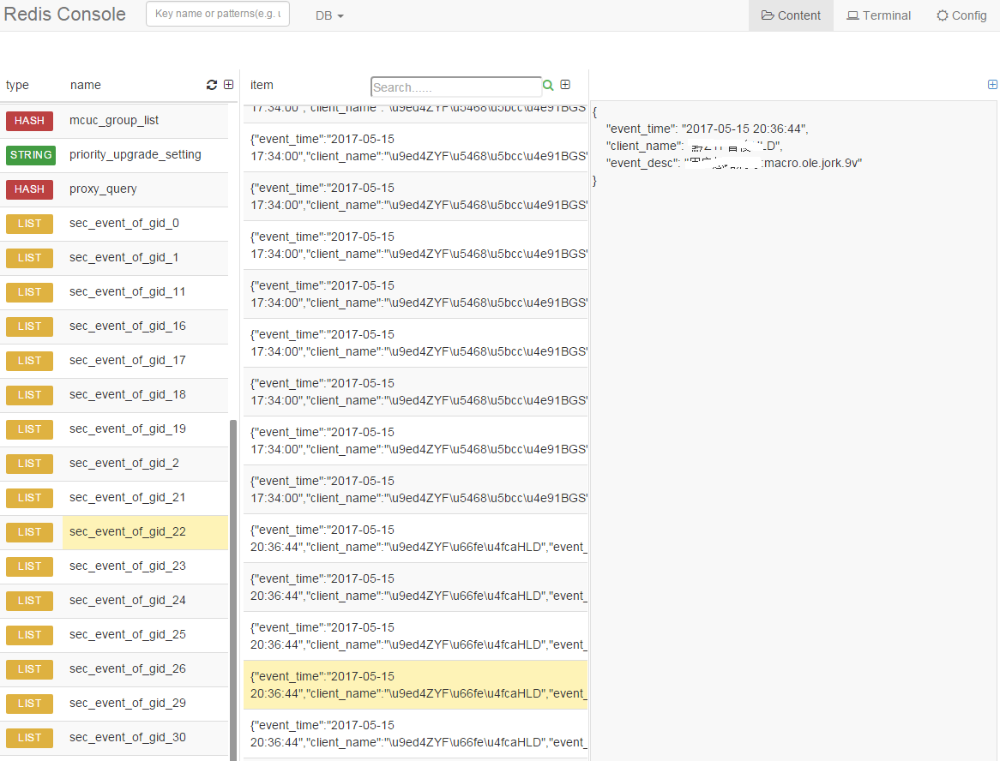
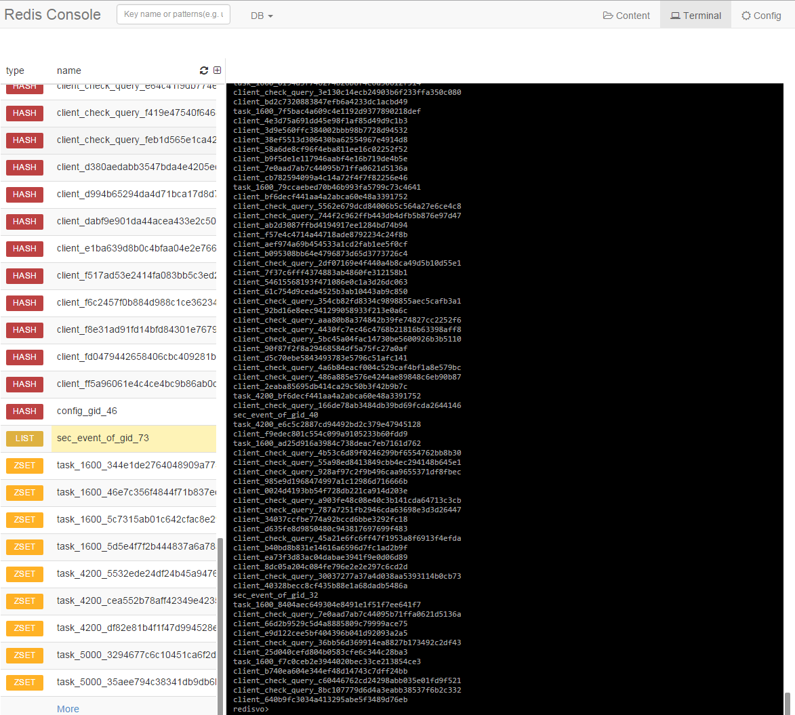
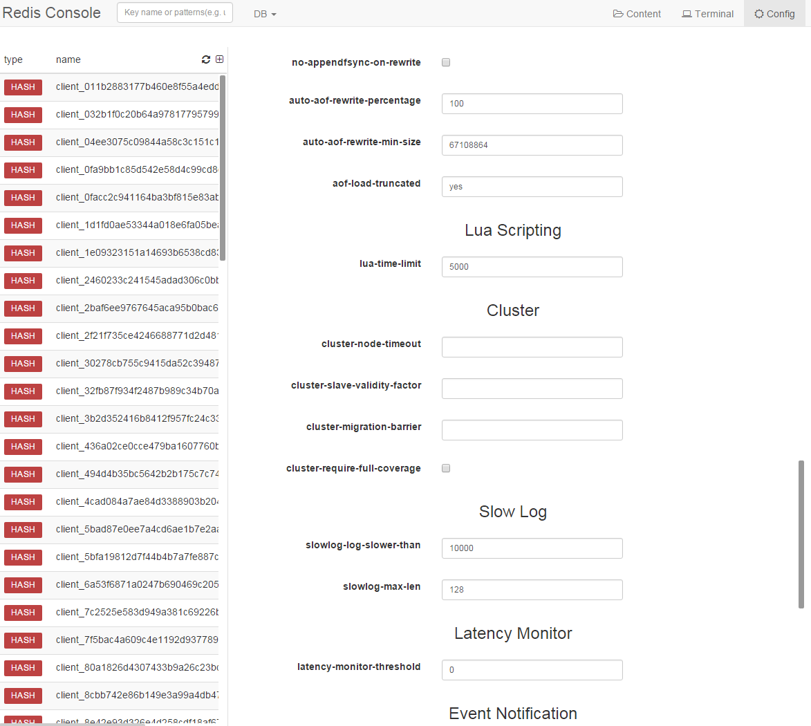

# Redis-Vo

## Overview

redisvo is a web-based Redis server written in Go and works on Windows, Linux and macOS machines. Using the Golang language cross-platform features at the same time the resource file compiled into binary files, so that the program zero dependent. redisvo is committed to making the operation of redis become visualized.

## Features

- Cross-platform support macOS/Linux/Windows 32/64-bit
- Simple installation (distributed as a single binary)
- Zero dependencies
- Each user can add its own personal Redis server
- Search key
- Timer refresh keys
- Web-cli interactive mode
- Change redis-config file easily

## Todo Lists

- Cluster management
- Redis-server Performance real-time monitoring

## Installation

[Precompiled binaries](https://github.com/taomin597715379/redisvo/releases) for supported 
operating systems are available.

## Contributing

Contributions are welcome! Open a pull request to fix a bug, or open an issue to discuss a new feature or change.

## Licenses

This program is under the terms of the MIT License. See LICENSE for the full license text.

## Interactive page

